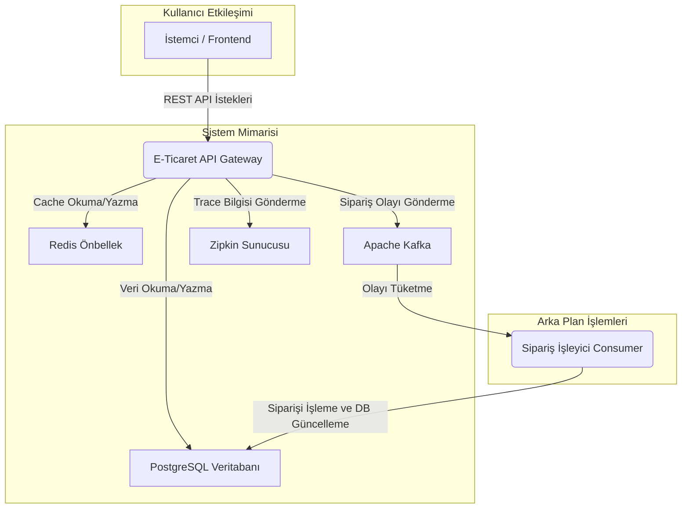

# E-Ticaret Backend Projesi

Bu proje, modern ve ölçeklenebilir bir e-ticaret platformu için geliştirilmiş, uçtan uca (end-to-end) ve "production-ready" prensipleriyle hazırlanmış bir backend sistemidir. Proje, sadece koddan ibaret olmayıp, kullanıma hazır bir **Postman koleksiyonu** ve başlangıç verilerini içeren bir **veritabanı script'i** ile birlikte sunularak, geliştirici deneyimini (Developer Experience) en üst düzeye çıkarmayı hedefler.

---

### 🏗️ Mimari Diyagram

### 🚀 Öne Çıkan Özellikler ve İşlevsellik

- **🧑‍💻 Kullanıma Hazır Geliştirici Deneyimi (Developer Experience):**
  - **Postman Koleksiyonu:** Tüm API endpoint'lerini içeren, anında test etmeye olanak tanıyan hazır bir koleksiyon (`postman/ecommerce-collection.json`).
  - **Başlangıç Veritabanı Script'i:** Projeyi anlamlı verilerle (ürünler, kategoriler, kullanıcılar) dolduran, `docker-compose up` sonrası çalıştırılabilen bir SQL dosyası (`database/initial_data.sql`).

- **🔐 Güvenlik ve Kullanıcı Yönetimi:** JWT tabanlı kimlik doğrulama, rol bazlı yetkilendirme ve `Bcrypt` ile güvenli şifreleme.
- **⚡️ Performans ve Önbellekleme (Caching):** **Redis** ile sık erişilen veriler için gelişmiş önbellekleme stratejisi.
- **🛒 Gelişmiş Sepet Yönetimi:** Anonim ve kayıtlı kullanıcılar için akıllı sepet birleştirme (cart merging).
- **🔄 Asenkron ve Uçtan Uca Sipariş Yaşam Döngüsü:** **Apache Kafka** ile dayanıklı (resilient) ve ölçeklenebilir asenkron sipariş işleme.

### ✨ Kod Kalitesi ve Test Stratejisi

Projemiz, en başından itibaren "production-ready" hedefiyle geliştirilmiştir. Bu doğrultuda kod kalitesi ve güvenilirlik en üst düzeyde tutulmuştur.

- **SonarQube Analizi:** Kod tabanımız, **SonarQube** ile sürekli olarak analiz edilmektedir. Bu analizler sonucunda:
  - **Sıfır Kritik Hata:** Projede `Medium` veya `High` seviyesinde hiçbir problem bulunmamaktadır.
  - **Güvenlik Zafiyeti Yok:** Bilinen hiçbir güvenlik açığı (vulnerability) veya güvenlik riski (severity) tespit edilmemiştir.
- **Yüksek Test Kapsamı:** Projemiz, **%90'ın üzerinde birim test (unit test) kapsamına** sahiptir.

### 🛠 Kullanılan Teknolojiler

- **Backend:** Java 21, Spring Boot 3.5.4, Spring Security, Spring for Apache Kafka, Spring Data JPA.
- **Veritabanı & Önbellekleme:** PostgreSQL, Redis.
- **Veritabanı Yönetimi:** Liquibase (Schema Migration).
- **Gözlemlenebilirlik (Observability):** Spring Boot Actuator, Micrometer, Brave, **Zipkin** (Distributed Tracing).
- **API Dokümantasyonu:** SpringDoc OpenAPI 2.8.9.
- **Test & Kod Kalitesi:** JUnit 5, Mockito, **SonarQube**.
- **Containerization & Build:** Docker, Docker Compose, Apache Maven 4.0.0.

### 📐 Mimari Yaklaşım ve En İyi Pratikler

- **Olay Güdümlü Akışlar (Kafka):** Sipariş yönetimi gibi kritik süreçler, Kafka kullanılarak asenkron olarak yönetilir. Veri tutarlılığını en üst düzeye çıkarmak için **Idempotent Producer** ve **`acks=all`** konfigürasyonları kullanılmıştır.
- **Önbellekleme Stratejisi (Redis):** Sık okunan veriler için `10 dakikalık` bir `time-to-live` (TTL) ile Redis önbelleklemesi uygulanmıştır.
- **Veritabanı Sürümleme (Liquibase):** Veritabanı şema değişiklikleri, kod tabanının bir parçası olarak yönetilir.
- **Dağıtık Gözlem (Distributed Tracing):** Micrometer ve **Zipkin** entegrasyonu, mikroservis ortamlarında isteklerin izlenmesini sağlar.

### ⚙️ Kurulum ve Çalıştırma

#### 1. Ön Koşullar
- Java 21 (JDK)
- Apache Maven
- Docker ve Docker Compose

#### 2. Yapılandırma (Configuration)
Projeyi çalıştırmadan önce aşağıdaki ortam değişkenlerini oluşturmanız gerekebilir:
- `DB_USER`, `DB_PASSWORD`, `JWT_SECRET_KEY`, `SONAR_TOKEN`

#### 3. Çalıştırma Adımları
1. **Projeyi klonlayın:** `git clone https://github.com/ahmetcalik/ecommerce-backend.git`
2. **Gerekli servisleri Docker ile başlatın:** `docker-compose up -d`
3. **Veritabanını Başlangıç Verileriyle Doldurun (Opsiyonel):** `database/initial_data.sql` script'ini veritabanınızda çalıştırın.
4. **Uygulamayı derleyin ve çalıştırın:** `mvn clean install && mvn spring-boot:run`

### 📚 API Dokümantasyonu ve Test

#### 1. Swagger UI (Otomatik Dokümantasyon)
Uygulama çalıştıktan sonra, interaktif Swagger UI arayüzüne buradan erişebilirsiniz:
[http://localhost:8080/swagger-ui.html](http://localhost:8080/swagger-ui.html)

#### 2. Postman Koleksiyonu (Kullanıma Hazır Test Seti)
Tüm API isteklerini içeren kullanıma hazır bir Postman koleksiyonu projeye dahil edilmiştir.
- **Dosya:** `postman/ecommerce-collection.json`
- **Kullanım:** Postman uygulamasında `Import` butonuna tıklayarak bu dosyayı içeri aktarın.
